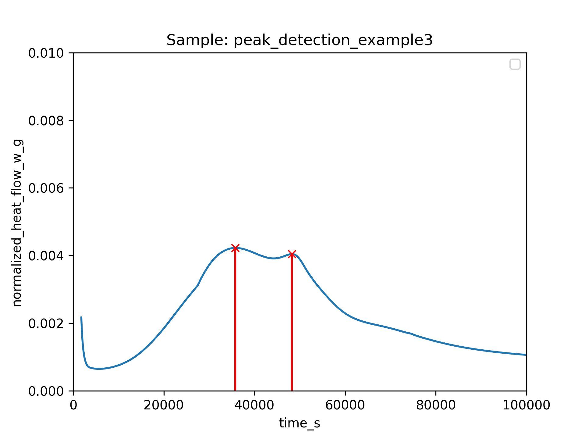

# Quantification of Calorimetry Data

## Peak Detection

First we load the data

```python
# %%
from pathlib import Path
import TAInstCalorimetry.tacalorimetry as ta

# define the Path of the folder with the calorimetry data
datapath = Path()

# experiments via class
tam = ta.Measurement(
    folder=datapath,
    regex=r".*file.*",
    show_info=True,
    auto_clean=False,
    cold_start=True,
)

```
Then, before we apply the `get_peaks()` method, we can define the ProcessingParameters if the default options are not suitable.
Here we define the peak prominence and give it the value 1e-4.
Note that only the largest peak will be detected if the prominence is set to 1e-3 in this example.

```python
# define the processing parameters
processparams = ta.ProcessingParameters()
processparams.peakdetection.prominence = 1e-4

# plot the peak position
fig, ax = ta.plt.subplots()

# get peaks (returns both a dataframe and extends the axes object)
peaks_found = tam.get_peaks(processparams, plt_right_s=3e5, ax=ax, show_plot=True)
ax.set_xlim(0, 100000)
ta.plt.show()

```
